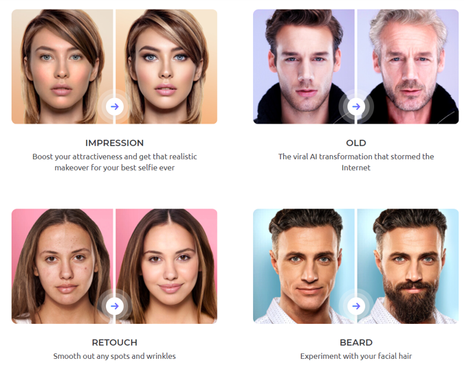

# Stabilize GAN training

**Why it matters**: Generative Adversarial Networks (GANs) is one of the most successful deep generative models that has been widely applied in various areas for example Faceapp uses GAN to realize fancy photo editing functions demonstrated in figure. However, different from training other generative models, GANs training is an adversarial game of two nonconvex neural networks.  In practice, it is more of an art than a science to train a GAN, which could take up to months.

**How**: In general, it is hard to come up with an algorithm that guarantees the global convergence because both discriminator and generator are non-convex functions of their parameters. 
1. But some progress has been made by simplifying the problem setting such as linear generator, Gaussian data. 
2. Aside from it, there are many papers proposing regularization techniques to stabilize training, which could fail badly in complex and multimodal domains. 
3. Another line of research propose to model GAN training from a game-theoretic perspective. These techniques yield training procedures that provably converge to some kind of approximate Nash equilibrium, but do so using unreasonably large resource constraints. 

Many algorithms have been developed and demonstrated their effectiveness in small scale experiments. 
Our previous work also provides empirical evidence of how GAN training can be stabilized by utilizing the interactions between discriminator and generator in [Implicit competitive regularization in GANs](https://proceedings.mlr.press/v119/schaefer20a.html). Play with a toy example. [Google Colab: train a GAN using ACGD algorithm](https://colab.research.google.com/drive/1-52aReaBAPNBtq2NcHxKkVIbdVXdyqtH?usp=sharing)

